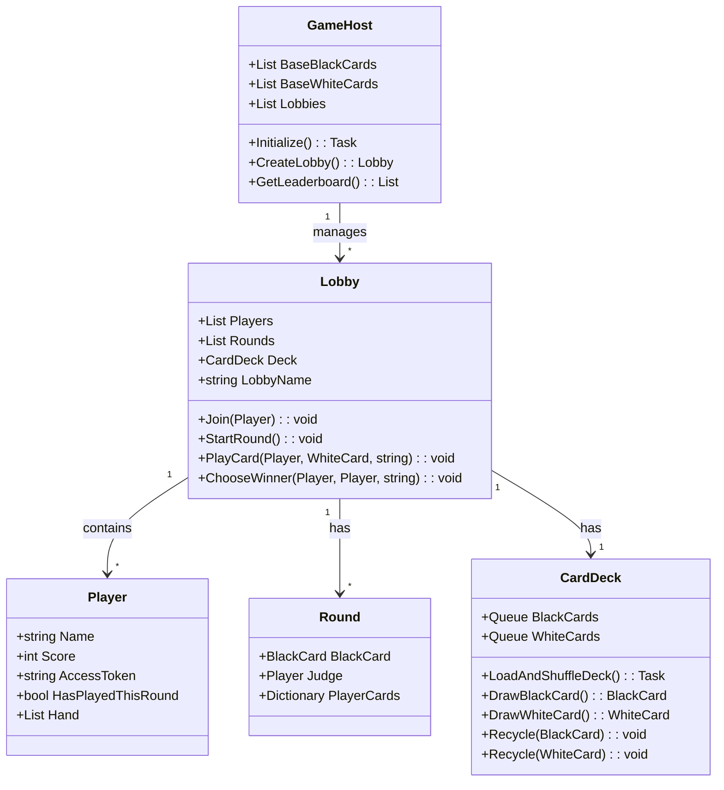

# Bedlam Online

An implementation of the Card game Bedlam by KC Lemson in C# 7.

Here's a high-level overview of how the game flow works:

GameHost: The top-level class that manages multiple Lobby instances. It loads the base deck of cards from an external URL upon initialization and shuffles the base deck for each new Lobby. It can create new Lobby instances and retrieve an overall leaderboard across all lobbies.

Lobby: Represents a game lobby. It maintains its own shuffled deck of cards and a list of Player instances. Players can join the lobby and are dealt a hand of cards when they join. The Lobby also maintains a record of Round instances, and can start new rounds and end rounds with a winning player.

Player: Represents a player in the game. It keeps track of the player's name, score, access token, hand of cards, and whether the player has played a card in the current round.

Round: Represents a round in the game. It maintains the black card in play, the judge for the round, and the cards played by each player.

CardDeck: Represents a deck of cards. It is responsible for loading, shuffling, and managing the deck of black and white cards. The deck can be loaded from a CSV file at a specified URL, and the cards can be drawn and recycled as needed.

This setup allows you to manage the game at a high level through the GameHost and also at a lower level (individual lobbies, players, rounds, and cards) as needed.

### Legal Notice
This game is a combination of the cardset from KC Lemson's Bedlam game, and the source code here has it's roots in the forked repository "Cards Against Humanity Online" (But it is a ground up rewrite of that code from scratch), this is in turn based off the card game [Cards Against Humanity](https://www.cardsagainsthumanity.com/) and [JSON Against Humanity](http://www.crhallberg.com/cah/json) which are available for free under the [Creative Commons BY-NC-SA 2.0 license](https://creativecommons.org/licenses/by-nc-sa/2.0/). I am neither associated with the Cards Against Humanity LLC, creators of Cards Against Humanity, nor Chris Hallberg, the creator of JSON Against Humanity, in any way. If you should have concerns regarding the correctness of my usage of their property, please send me an email (the address is available through my profile).
